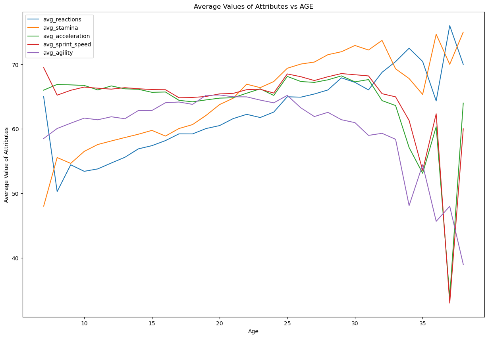

# Final Project -- Analyzing European Soccer 

## Introduction
We investigated data from European professional soccer leagues between 2007 and 2016. We built models that could predict ____ from ____. 

## Data Acquisition
We obtained our data as csv files from Kaggle from the [European Soccer Database](https://www.kaggle.com/datasets/hugomathien/soccer). We also incorporated data on goals scored from Kaggle's [supplemental database](https://www.kaggle.com/datasets/jiezi2004/soccer). The data includes data about players' attributes (e.g. height, weight, age) and match results between European teams in each league. 

## Data Cleaning
### Cleaning Player Dataset
For our player attributes, we imputed data for the columns of categorical variables (dominant foot, attacking work rate, defensive work rate). We simply replaced any missing and nonsense values with the most frequent category. Additionally, we used one-hot encoding and ordinal encoding to convert these categorical variables to integers that our models can input. 

Each player in our dataset has over 30 standardized quantitative variables ranging from 0 to 100 that indicate various athletic qualities (e.g. abiility to handle penalties). 

We merged our two player attributes datasets into one dataframe for easier indexing where each row represents a season that a given player was rated. 

### Cleaning Match and Team Dataset

## Exploratory Data Analysis

[Click here to view the EDA](index.html)

Below is a histogram and KDE (smoothed out histogram) of player potential of all the more than 11,000 players in our dataset. Player potential refers to a player's future ability to perform at a high level, and this value ranges from 0 to 100. The distribution is approximately normally disitrbuted with most players' ratings between 60 and 90. 
.jpg#center){ width=300px height=200px }

###Correlation Matrices

Here is a correlation matrix between the numeric variables for our player dataset. 

Some correlations jump out namely the ...

Goalie attributes         and crossing to ball control
 

### Effect of age on players

![]
## Modeling

Additionally, we created a neural network to predict a soccer player's rating for the next season based on their attributes and ratings from the past three seasons. We initially experimented with regression models like OLS, Lasso, and Ridge for rating prediction, but these models struggled to account for time series data from a given player. 

## Conclusion

