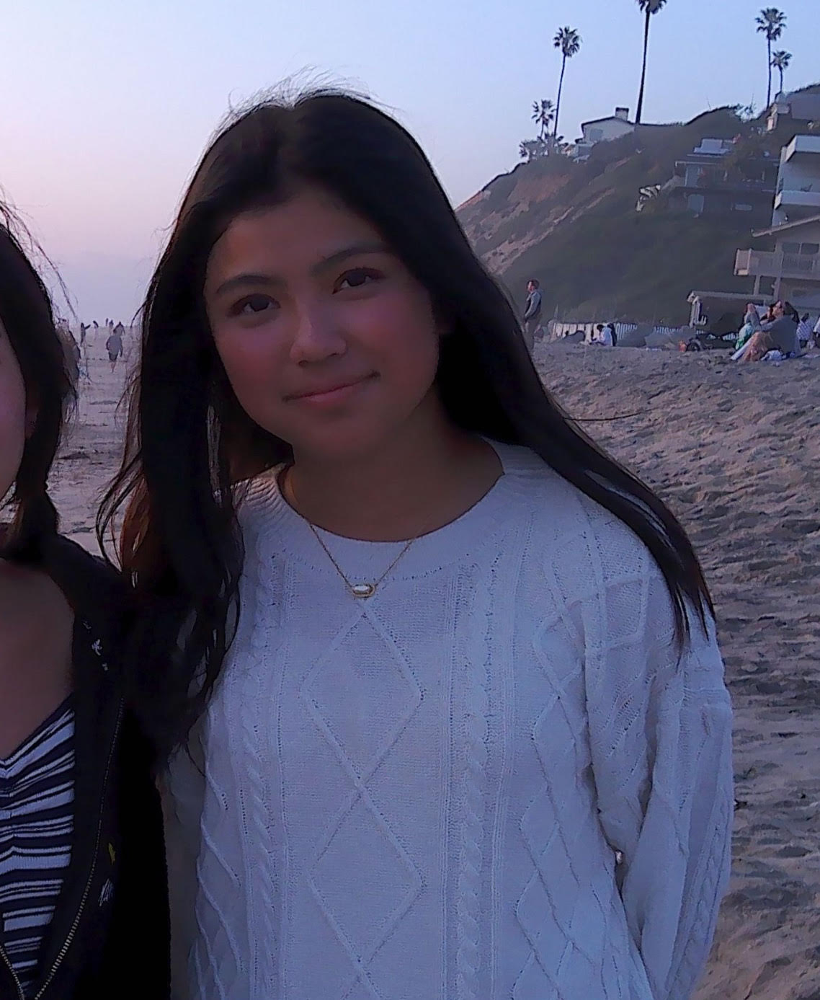

---

### Gaurav Gupta

  

  

    

      Gaurav is a rising senior from Pleasanton in the Bay Area.
    

    <ul style="margin: 0; padding-left: 20px;">
      <li>Loves to play chess and do brain teasers</li>
      <li>Watches educational YouTube videos in free time (e.g. Veritasium, TedEd)</li>
      <li>Enjoys learning something new every day</li>
    </ul>
  

---

### Armaan Malkani

  

  

    

      Armaan is a rising senior from Sunnyvale in the Bay Area. 
    

    <ul style="margin: 0; padding-left: 20px;">
       <li>Loves to play sports including basketball and tennis</li>
      <li>Enjoys traveling and visiting new places</li>
      <li>Likes watching TV shows in his free time</li>
    </ul>
  

---

## Jordan Han

  

  

    

      Jordan Han is a rising senior from San Diego
    

    <ul style="margin: 0; padding-left: 20px;">
      <li>10'13"</li>
      <li>reads feminist literature</li>
      <li>drinks matcha</li>
    </ul>
  

  

---

## Aryav Semwal

  

  

    

      Aryav is a rising junior from San Ramon in the Bay Area...
    

    <ul style="margin: 0; padding-left: 20px;">
      <li>Loves reading comics and watching movies</li>
      <li>Favorite subjects are Math and History</li>
      <li>Invincible and Spider-Man are his favorite heroes</li>
    </ul>
  

  

---

## Brianna Zhang

  

  

    

      Brianna Zhang is a rising junior from San Diego...
    

    <ul style="margin: 0; padding-left: 20px;">
      <li>Favorite food is pasta</li>
      <li>Has two dogs</li>
      <li>Enjoys listening to music</li>
    </ul>
  

  

