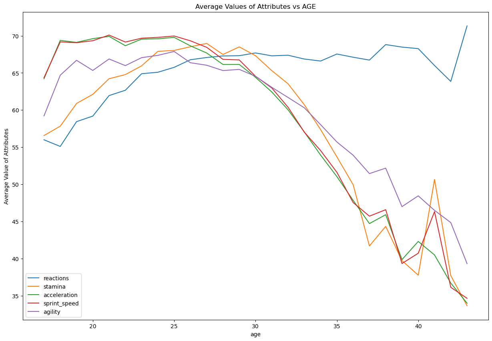
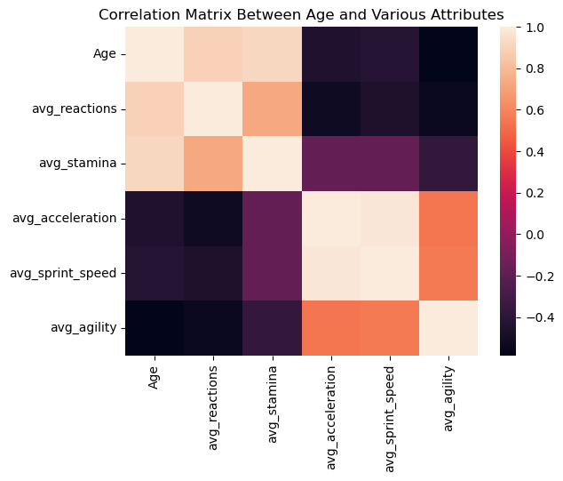

# Final Project -- Analyzing European Soccer 

## Introduction
We investigated data from European professional soccer leagues between 2007 and 2016. We built models that could predict ____ from ____. 

## Data Acquisition
We obtained our data as csv files from Kaggle from the [European Soccer Database](https://www.kaggle.com/datasets/hugomathien/soccer). We also incorporated data on goals scored from Kaggle's [supplemental database](https://www.kaggle.com/datasets/jiezi2004/soccer). The data includes data about players' attributes (e.g. height, weight, age) and match results between European teams in each league. 

## Data Cleaning
### Cleaning Player Dataset
For our player attributes, we imputed data for the columns of categorical variables (dominant foot, attacking work rate, defensive work rate). We simply replaced any missing and nonsense values with the most frequent category. Additionally, we used one-hot encoding and ordinal encoding to convert these categorical variables to integers that our models can input. 

Each player in our dataset has over 30 standardized quantitative variables ranging from 0 to 100 that indicate various athletic qualities (e.g. abiility to handle penalties). 

We merged our two player attributes datasets into one dataframe for easier indexing where each row represents a season that a given player was rated. 

### Cleaning Match and Team Dataset

## Exploratory Data Analysis

[Click here to view the EDA](index.html)

Below is a histogram and KDE (smoothed out histogram) of player potential of all the more than 11,000 players in our dataset. Player potential refers to a player's future ability to perform at a high level, and this value ranges from 0 to 100. The distribution is approximately normally disitrbuted with most players' ratings between 60 and 90. 
.jpg#center)

### Correlation Matrices

This heatmap shows the correlation matrix between different player attributes. Correlation values range from -1 to 1, where:
- 1 means two traits increase together,
- -1 means one increases while the other decreases,
- 0 means no relationship.

- Overall rating and potential are strongly correlated (0.77), as expected. Skills like short passing, ball control, and vision also show strong connections, indicating that good passers tend to be well-rounded technically.
- Agility, acceleration, and sprint speed are closely related, representing physical quickness.
- Defensive stats such as interceptions and tackling are related but not strongly connected to offensive traits.
- Goalkeeper attributes form a separate group, highly correlated with each other but negatively correlated with outfield player skills.

#### Technical Skills
 
- Ball control is highly correlated with short passing (0.89), dribbling (0.90), and crossing (0.81), indicating that players who are good in one technical skill often excel in others.
- Volleys, finishing, and curve also show moderate to strong correlations with ball control and dribbling, further linking offensive precision with overall technique.

#### Goalkeeper Attributes

- Goalkeeping attributes such as diving, handling, reflexes, and positioning are all highly correlated (above 0.93 in most cases).
- These values show that goalkeeper ability is largely defined by a tight group of specialized skills that behave independently from outfield traits.

### Effect of age on players

Here, we examined how football players’ attributes change as they age. We used each player’s birthday and the date of their most recent data to calculate their age. Then we grouped the players by age and found the average values for five key traits: reactions, stamina, acceleration, sprint speed, and agility. The line chart we created shows how these averages shift as players get older.

The chart shows that physical traits like stamina, sprint speed, acceleration, and agility increase until around age 26 to 28 and then drop quickly after age 30. On the other hand, reactions continue to improve slightly with age and stay high even as the player gets older. This tells us that while older players may lose physical speed and movement, they often remain mentally sharp and experienced, which can still make them very effective on the field.

To better understand how these attributes are related, we created a correlation matrix. The heatmap shows that physical traits such as sprint speed, agility, and stamina are strongly linked to one another and all decrease with age, while reactions are positively correlated with age. This means players who are quick often also have strong stamina and agility. Overall, the analysis shows that aging affects physical abilities more than mental sharpness, which helps explain why older players can still perform well in roles that rely on awareness and decision-making rather than speed.

### Bookmarkers

One of the features that our model uses to predict a teams perfomance during a season are the betting odds from Bookmarkers so we evaluated the performance of these Bookmakring companies using their odds and turning them into the probabilities for the outcome of games. Then extrapolating a result and determining the accuracy, bier score, and margin which are graphed above.

## Modeling

Additionally, we created a neural network to predict a soccer player's rating for the next season based on their attributes and ratings from the past three seasons. We initially experimented with regression models like OLS, Lasso, and Ridge for rating prediction, but these models struggled to account for time series data from a given player. 

## Conclusion

